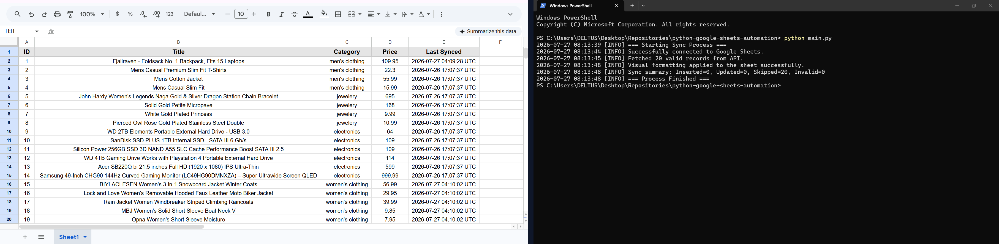
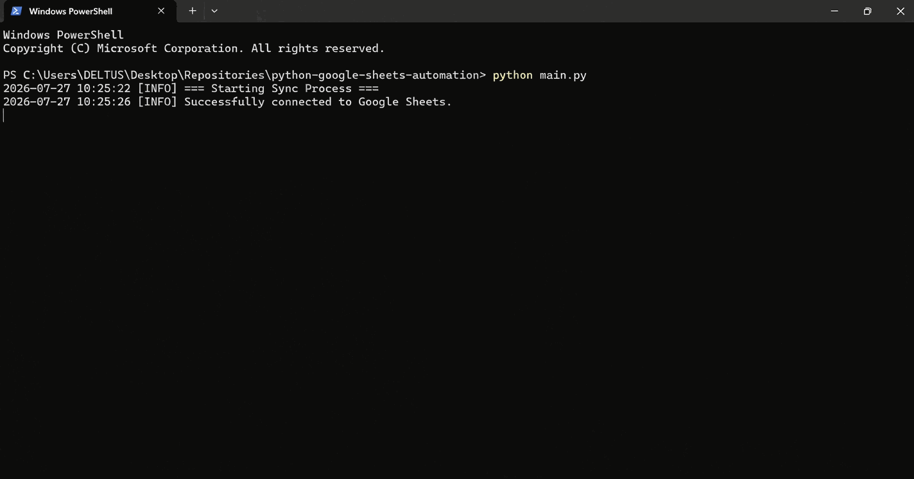
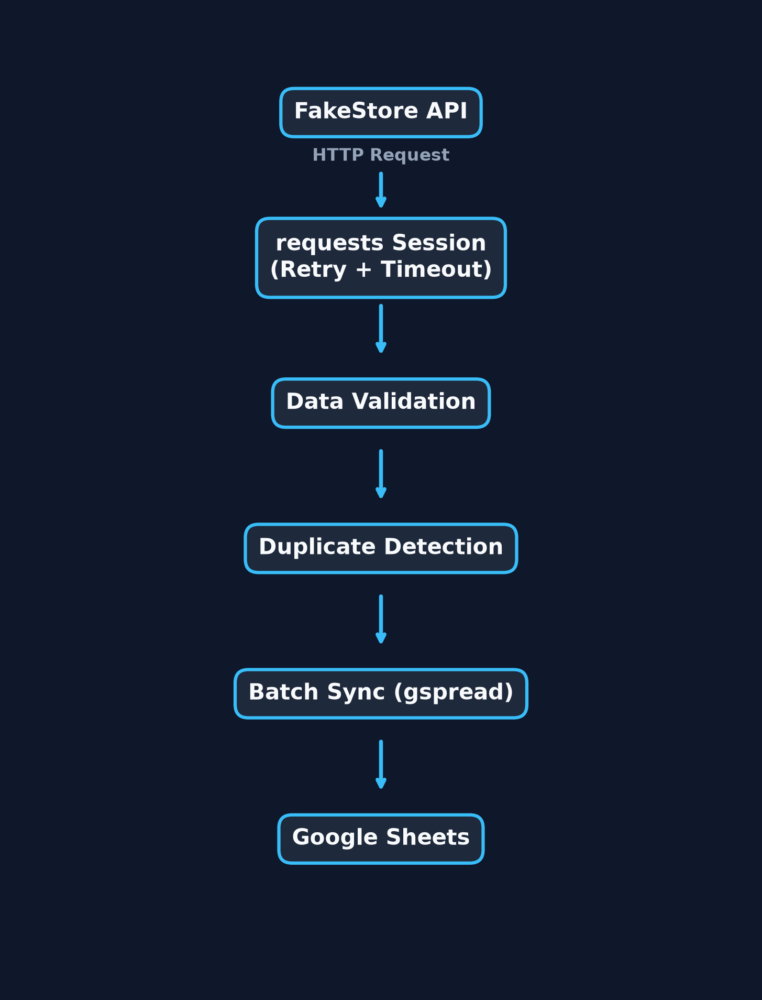

# Python Google Sheets Automation

<p align="center">


</p>

A **production-ready Python automation project** that securely fetches data from REST APIs, validates responses, prevents duplicate records, and synchronizes data with Google Sheets using efficient batch operations.

---

# Preview

## Screenshot

<p align="center">

</p>

---

## Demo

<p align="center">

</p>

---

## Architecture

<p align="center">

</p>

---

# Highlights

- Production-ready architecture
- Google Sheets API integration
- REST API synchronization
- Duplicate detection
- Automatic update of modified records
- Batch insert & batch update
- Structured logging
- Retry strategy with exponential backoff
- Timeout protection
- Environment-based configuration
- Clean Code principles
- Type hints & Dataclasses

---

# Overview

This project demonstrates software engineering practices commonly found in production Python applications.

Instead of being a simple automation script, it focuses on building a reliable, maintainable, and scalable synchronization pipeline.

The application performs the following workflow:

- Connects securely to Google Sheets
- Fetches data from a REST API
- Validates incoming JSON responses
- Normalizes data
- Detects duplicate records
- Updates modified rows
- Inserts new rows using batch operations
- Produces structured application logs
- Handles temporary network failures automatically

This repository serves as a portfolio project demonstrating backend automation, API integration, and clean software engineering practices.

---

# Workflow

```text
REST API
    │
    ▼
HTTP Request
    │
    ▼
Response Validation
    │
    ▼
Data Normalization
    │
    ▼
Duplicate Detection
    │
    ▼
Insert / Update Decision
    │
    ▼
Batch Synchronization
    │
    ▼
Google Sheets
```

---

# Features

- Secure Google Service Account authentication
- Google Sheets API integration
- REST API communication
- Automatic retry mechanism
- Exponential backoff
- Timeout protection
- JSON validation
- Duplicate prevention
- Existing record updates
- Batch insertion
- Batch updates
- Structured logging
- Environment configuration using `.env`
- Numeric type validation
- Dataclasses
- Type hints
- Robust exception handling

---

# Skills Demonstrated

- Python Automation
- REST API Integration
- Google Sheets API
- Data Synchronization
- HTTP Networking
- Logging & Monitoring
- Retry Strategies
- Batch Processing
- Data Validation
- Environment Variables
- Clean Code
- Software Architecture

---

# Technology Stack

| Technology | Purpose |
|------------|---------|
| Python 3.8+ | Core language |
| requests | HTTP communication |
| urllib3 | Retry mechanism |
| gspread | Google Sheets integration |
| oauth2client | Authentication |
| python-dotenv | Environment management |

---

# Project Structure

```text
python-google-sheets-automation
│
├── assets
│   ├── screenshot.png
│   ├── demo.gif
│   └── architecture.png
│
├── main.py
├── requirements.txt
├── .env.example
├── .gitignore
├── LICENSE
└── README.md
```

---

# Requirements

- Python 3.8+
- Google Cloud Service Account
- Google Sheets API enabled
- Internet connection

---

# Installation

## Clone the repository

```bash
git clone https://github.com/saeedakbarzade1371-rgb/python-google-sheets-automation.git

cd python-google-sheets-automation
```

---

## Create a virtual environment

### Windows

```bash
python -m venv venv

venv\Scripts\activate
```

### macOS / Linux

```bash
python3 -m venv venv

source venv/bin/activate
```

---

## Install dependencies

```bash
pip install -r requirements.txt
```

---

# Configuration

Create a local `.env` file using the provided template.

```env
GOOGLE_CREDENTIALS_FILE=credentials.json
GOOGLE_SHEET_NAME=Shopify_Orders_Sync
API_URL=https://fakestoreapi.com/products
API_TIMEOUT=15
```

Place your Google Cloud Service Account file inside the project root directory:

```text
credentials.json
```

> **Important**
>
> Never commit `.env` or `credentials.json` to GitHub.

---

# Usage

```bash
python main.py
```

---

# Example Output

```text
2026-07-26 15:40:22 [INFO] === Starting Sync Process ===
2026-07-26 15:40:23 [INFO] Successfully connected to Google Sheets.
2026-07-26 15:40:24 [INFO] Fetched 20 records from API.
2026-07-26 15:40:24 [INFO] Inserted 20 new records.
2026-07-26 15:40:24 [INFO] Sync summary:
Inserted=20
Updated=0
Skipped=0
Invalid=0
2026-07-26 15:40:24 [INFO] === Process Finished ===
```

---

# Security

- Environment variables via `.env`
- Credentials excluded using `.gitignore`
- Secure Google Service Account authentication
- Timeout protection
- Retry strategy
- Input validation
- Graceful exception handling

---

# Performance

Performance optimizations include:

- Batch insertion
- Batch updates
- Duplicate detection
- Single synchronization timestamp
- Reduced Google Sheets API calls
- Retry with exponential backoff
- Efficient memory usage

---

# Future Improvements

- Unit Testing with pytest
- GitHub Actions CI/CD
- Docker support
- SQLite cache
- Automatic spreadsheet creation
- Multiple worksheet support
- Configuration validation using Pydantic

---

# License

This project is licensed under the **MIT License**.

See the **LICENSE** file for more information.

---

# Author

**Saeed Akbarzade**

GitHub:
https://github.com/saeedakbarzade1371-rgb

---

<p align="center">

⭐ If you found this project useful, consider giving it a star.

</p>